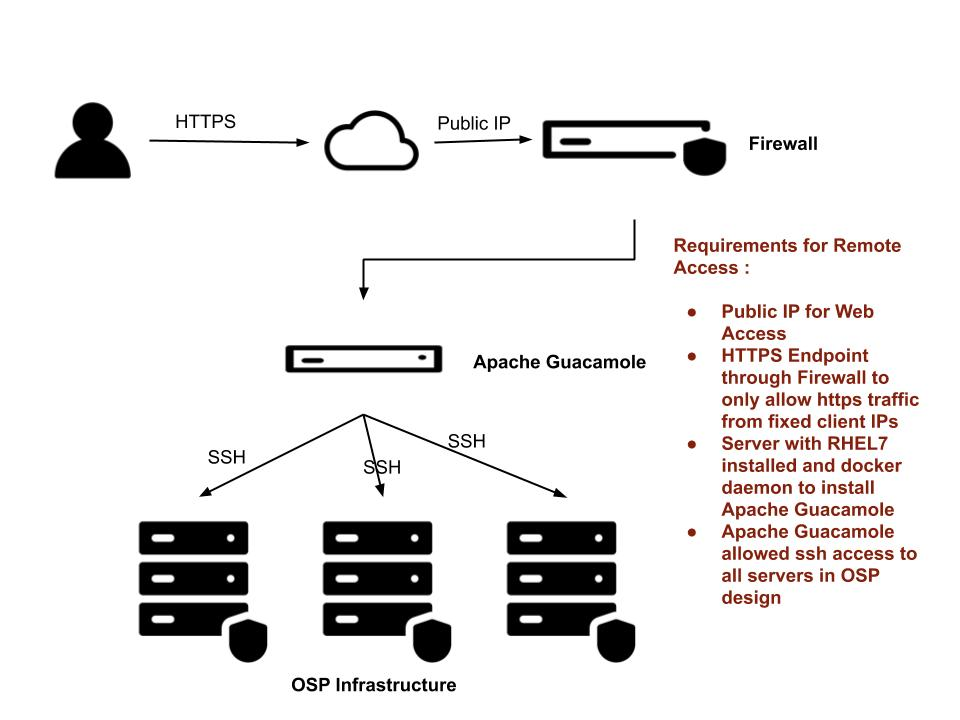

# Apache Guacamole Setup 

## This is to setup client-less secure access to servers for remote setup. A sample image for client access is shown below :

All Icons in the above diagram are licensed by [Red Hat Inc](https://www.redhat.com/en) under [Creative Commons Attribution 3.0 Unported license](https://creativecommons.org/licenses/by/3.0/)

## Requirements

* Remote access to linux servers terminal (ssh) without any port forwarding etc..

* Remote access to browsers to access web servers/services exposed by servers in the Internal Network.

## Proposed Solution

* Install Apache Guacamole on a DMZ server (that allows https access) using docker images

* Configure Users (with authentication) and Groups (for Hosts) in Apache Guacamole

* Configure Connections to internal servers using ssh

* Configure X11 on the local server (on which Apach Guacamole)

* Configure VNC Connection in Apache Guacamole to localhost so that this VNC connection can be used to view browser

## Installation Steps

* Pull the required docker images

 * $ docker pull postgres
 * $ docker pull guacamole/guacd
 * $ docker pull guacamole/guacamole
